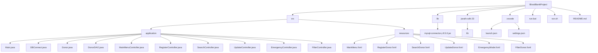

```mermaid
graph TD
    A[BloodBankProject] --> B[src]
    A --> C[lib]
    A --> D[javafx-sdk-23]
    A --> E[.vscode]
    A --> F[run.bat]
    A --> G[run.sh]
    A --> H[README.md]

    B --> I[application]
    B --> J[resources]

    I --> K[Main.java]
    I --> L[DBConnect.java]
    I --> M[Donor.java]
    I --> N[DonorDAO.java]
    I --> O[MainMenuController.java]
    I --> P[RegisterController.java]
    I --> Q[SearchController.java]
    I --> R[UpdateController.java]
    I --> S[EmergencyController.java]
    I --> T[FilterController.java]

    J --> U[MainMenu.fxml]
    J --> V[RegisterDonor.fxml]
    J --> W[SearchDonor.fxml]
    J --> X[UpdateDonor.fxml]
    J --> Y[EmergencyMode.fxml]
    J --> Z[FilterDonor.fxml]

    C --> AA[mysql-connector-j-9.5.0.jar]

    D --> AB[lib]

    E --> AC[launch.json]
    E --> AD[settings.json]
```
